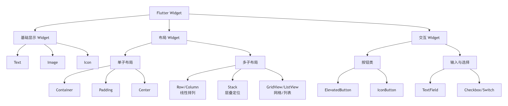

### Flutter 安装中遇到的问题

- 问题：Downloading the Flutter SDK. This may take a few minutes.
- 解决：以管理员身份 运行 PowerShell
- 输入以下命令

```sh
$env:PUB_HOSTED_URL="https://pub.flutter-io.cn"

$env:FLUTTER_STORAGE_BASE_URL="https://storage.flutter-io.cn"
```

### flutter 依赖下载

```bash
flutter pub add ant_design_flutter
```

### Flutter 是什么？它的核心优势是什么？

解答：Flutter 是 Google 推出的跨平台 UI 框架，通过自绘引擎（而非 WebView / 原生组件桥接）实现多端一致的 UI，支持 iOS / Android / Windows / macOS / Web 等平台。

核心优势：

- 跨平台一致性：自绘渲染，无原生组件差异；

- 高性能：Skia 引擎 + JIT/AOT 编译，接近原生性能；

- 热重载：开发效率高；

- 单一代码库：一套代码多端运行；

- 丰富的组件库：Material Design / Cupertino 组件开箱即用

### Dart 语言的核心特性？为什么 Flutter 选择 Dart？

Dart 核心特性：

- 强类型（支持动态类型）、面向对象、异步（async / await / Future / Stream）；

- 支持 JIT（即时编译，热重载）和 AOT（提前编译，发布包高性能）；

- 单线程 + 事件循环（Isolate 实现多线程）；

- 空安全（Null Safety）。

选择 Dart 原因：

- JIT/AOT 兼顾开发效率和运行性能；

- 单线程模型降低跨线程通信成本；

- 静态类型减少运行时错误；

- Google 可控，易与 Flutter 深度优化

### Flutter 的三大核心架构层是什么？

- 框架层（Framework）：Dart 编写的上层 API，如 Widget、RenderObject、Animation 等；

- 引擎层（Engine）：C/C++ 编写的核心，包含 Skia 渲染引擎、Dart 运行时、文本渲染等；

- 嵌入层（Embedder）：适配不同平台的底层封装，如 Android 的 Activity、iOS 的 UIViewController 集成。

### Flutter 核心概念

- 变量声明（var / final / const）
  - var 适用场景：类的成员变量、函数参数、需要明确类型的核心变量，类型推断可变

  - final 赋值后不可修改，支持类型推断或显式类型, `运行时确定值`（StatelessWidget / StatefulWidget 的成员参数,可赋值动态数据，如用户 ID、接口返回的固定值、设备信息）

  - const 赋值后不可修改，支持类型推断或显式类型,`编译时确定值`（只能赋值「字面量」，如数字、字符串、const 构造的对象）

  - 总结
    - 可变性选择：能不用可变变量（var/显式类型）就不用，优先用 final（运行时）/ const（编译时），符合 Flutter Widget 的不可变设计，还能优化性能；

    - 空安全选择：可空变量加`?`，延迟初始化用`late`，非空断言!尽量少用（优先用??判空）；

    - Flutter 实战原则：
      - StatelessWidget（无状态） 的参数必须用 `final`；

      - 静态 Widget（如固定文本、边距）用`const`修饰，减少重建

      - StatefulWidget 中延迟初始化的非空变量用`late`

### [Flutter 与 Vue、React 的区别](https://www.doubao.com/chat/31624762199670018)

- https://www.doubao.com/chat/31624762199670018

- 基础组件（如 Text / Container / Row / Column）

- Widget 生命周期：StatelessWidget（无状态）和 StatefulWidget（有状态）的区别
  - 如果一个 Widget 会变化（例如由于用户交互），它是有状态的。然而，如果一个 Widget 响应变化，它的父 Widget 只要本身不响应变化，就依然是无状态的

- 布局系统：

基于 Widget 嵌套的布局（如 Stack/Expanded/MediaQuery）和传统前端的 CSS 布局逻辑不同，需要适应 “约束向下传递，尺寸向上反馈” 的机制；

- 状态管理：简单场景用 setState 即可，但复杂应用需要学习 `Provider / Bloc / GetX` 等方案，理解 “状态分离” 的思想需要时间

- Flutter 用 Row / Column（对应 Flex）、Stack（对应绝对定位）、Expanded（对应 flex:1）等 Widget 实现布局

- 通过 Padding / SizedBox 控制间距、MediaQuery 获取屏幕尺寸

- 强制空安全：
  - String? a = null;（加?表示可空）

  - String b = a!;（!断言非空，类似 TS 的!）

- Dart 默认开启空安全（Null Safety），变量默认不可为空

- Dart 的箭头函数（=>）只能是单行表达式（无{}）

- Dart 区分命名参数（调用时需写参数名：fn(a:10, b:20)）和位置参数

- Flutter 无 “模板语法”，所有 UI 由 Widget 对象嵌套实现

- Flutter 无 “通用容器” `<div>`，需用 Container（带样式的容器）、SizedBox（占位）、Padding（内边距）等专用 Widget 替代

- Flutter 的交互 Widget（如 ElevatedButton）需通过 onPressed 等属性绑定事件，而非 HTML 的 onClick

- Flutter 无 CSS 的 “盒模型属性”，需用 EdgeInsets、double.infinity 等 Dart 对象/常量替代；布局逻辑由 Row/Column/Stack 等 Widget 实现

- Flutter 用 Expanded Widget 实现 “flex:1” 效果，需包裹子 Widget

- Flutter 用 Stack（相对定位容器）+ Positioned（绝对定位子 Widget）替代 CSS 的 position:relative/absolute

- Flutter 无 “模板指令”，直接用 Dart 的三元运算符或专用 Widget（Visibility/If）实现条件渲染；前端支持&&短路渲染，Flutter 需用三元或 if 块（集合内）

- Flutter 推荐用 `ListView.builder`（懒加载，性能优）替代前端的 map 循环；需显式指定`itemCount`和`itemBuilder`

- Flutter 的组件内状态必须放在 State 类中，通过 setState 触发重建

- Flutter 的状态管理依赖 ChangeNotifier/Provider（或 Bloc/GetX），需手动调用 notifyListeners

- Dart 的 Future 对应 JS 的 Promise，用法几乎一致；Dart 的 Stream 原生支持流式数据（无需第三方库），async\*/yield 替代 RxJS 的 Observable/next

- Flutter 无 CSS 文件，样式通过 TextStyle/BoxDecoration 等对象定义；全局样式依赖 ThemeData，而非 CSS 全局类或变量；尺寸无单位（基于逻辑像素）

- Flutter 通过类成员变量接收参数，需在构造函数中声明；

- Flutter 无 “插槽” 概念，通过 List<Widget> children 或命名参数（如 title）实现插槽效果

- @override：标注方法重写父类，核心作用是编译器校验 + 代码可读性，是 Flutter 生命周期方法的必备注解；

- \_：将标识符私有化，核心作用是封装内部实现 + 符合 Flutter 规范，State 类必须私有化；

- 每个 stateful widget 都有一个 initState() 方法，它会在 widget 创建并添加到 widget 树时调用。你可以重写这个方法并在其中进行初始化，但这个方法的第一行 必须 是 super.initState()

- 许多内置的 Widget 都是无状态的，比如 Padding、Text 和 Icon, 当你构建自定义 Widget 时，优先采用 无状态 (Stateless) Widget

- 如果一个 Widget 的某些特性需要随用户交互或其他因素而改变，则这个 Widget 是有状态的, StatefulWidget 没有 build 方法，它们的用户界面是通过关联其 State 对象来构建的

- Flutter 没有 “给 Text 加点击事件” 的写法，而是用 GestureDetector 包裹 Text

```dart
GestureDetector(
  onTap: () => print("文字被点击"),
  child: const Text("可点击的文字"),
);
```

- Container 不是万能的：新手容易所有场景都用 Container，其实简单的边距用 Padding、固定大小用 SizedBox，性能更好

### 部件



### 基础显示 Widget

这些是构成界面静态内容的基础。

| Widget | 核心作用     | 常用属性 (类型)                                                                                                          | 说明                                                   |
| ------ | ------------ | ------------------------------------------------------------------------------------------------------------------------ | ------------------------------------------------------ |
| Text   | 显示简单文本 | [data](file://d:\project\my-project\flutter\flutter_application\ios\Runner.xcworkspace\contents.xcworkspacedata)(String) | 要显示的文本                                           |
|        |              | `style`(TextStyle)                                                                                                       | 文本样式（颜色、字体、大小等）                         |
|        |              | `textAlign`(TextAlign)                                                                                                   | 文本对齐方式（如居中）                                 |
|        |              | `maxLines`(int)                                                                                                          | 最大显示行数                                           |
| Image  | 显示图片     | `image`(ImageProvider)                                                                                                   | 图片源，如 Image.asset（本地）或 Image.network（网络） |
|        |              | `width`/ `height`(double)                                                                                                | 图片容器的宽高                                         |
|        |              | `fit`(BoxFit)                                                                                                            | 图片填充模式（如 BoxFit.cover拉伸裁剪以填满）          |
| Icon   | 显示图标     | `icon`(IconData)                                                                                                         | 具体图标，如 Icons.star                                |
|        |              | `color`(Color)                                                                                                           | 图标颜色                                               |
|        |              | `size`(double)                                                                                                           | 图标大小                                               |

### 布局 Widget

布局 Widget 负责安排其他 Widget 在屏幕上的位置，可分为单子布局和多子布局。

#### 单子布局 Widget

常用于包裹一个子 Widget，提供约束或装饰。

| Widget    | 核心作用                                             | 常用属性 (类型)                         | 说明                                                                                   |
| --------- | ---------------------------------------------------- | --------------------------------------- | -------------------------------------------------------------------------------------- |
| Container | 最常用的容器，可设置尺寸、背景、边距等，属性非常丰富 | `child`(Widget)                         | 容纳的子组件                                                                           |
|           |                                                      | `width`/ `height`(double)               | 宽高                                                                                   |
|           |                                                      | `padding`/ `margin`(EdgeInsetsGeometry) | 内边距/外边距                                                                          |
|           |                                                      | `decoration`(Decoration)                | 装饰，如颜色(color)、边框(border)、圆角(borderRadius)、阴影(boxShadow)、渐变(gradient) |
| Padding   | 专用于设置内边距，比Container更专注                  | `padding`(EdgeInsetsGeometry)           | 内边距设置                                                                             |
|           | `child`(Widget)                                      | 容纳的子组件                            |                                                                                        |
| Center    | 将其子 Widget 居中显示                               | `child`(Widget)                         | 容纳的子组件                                                                           |
|           |                                                      | `widthFactor`/ `heightFactor`(double?)  | 宽高因子，null表示使用子组件原始尺寸                                                   |

#### 多子布局 Widget

用于排列多个子 Widget。

| Widget       | 核心作用                                | 常用属性 (类型)                           | 说明                                                               |
| ------------ | --------------------------------------- | ----------------------------------------- | ------------------------------------------------------------------ |
| Row / Column | 在水平(Row)或垂直(Column)方向排列子组件 | `children`(List<Widget>)                  | 子组件列表                                                         |
|              |                                         | `mainAxisAlignment`(MainAxisAlignment)    | 主轴（Row是横向，Column是纵向）对齐方式，如spaceEvenly（均匀分布） |
|              |                                         | `crossAxisAlignment`(CrossAxisAlignment)  | 交叉轴对齐方式，如CrossAxisAlignment.center（居中对齐）            |
| Stack        | 层叠布局，子组件可以重叠                | `children`(List<Widget>)                  | 子组件列表，后面的孩子在上面                                       |
|              |                                         | `fit`(StackFit)                           | 如 StackFit.expand 拉伸子组件以填充容器                            |
|              |                                         | `alignment`(AlignmentGeometry)            | 子组件在 Stack 中的对齐方式                                        |
| ListView     | 可滚动的垂直列表布局                    | `children`(List<Widget>) 或 `itemBuilder` | 列表项组件                                                         |
|              |                                         | `scrollDirection`(Axis)                   | 滚动方向，默认 Axis.vertical                                       |
|              |                                         | `physics`(ScrollPhysics)                  | 滚动效果，如 BouncingScrollPhysics                                 |
| GridView     | 可滚动的网格布局                        | `gridDelegate`(SliverGridDelegate)        | 网格布局策略，如 SliverGridDelegateWithFixedCrossAxisCount         |
|              |                                         | `children`(List<Widget>) 或 `itemBuilder` | 网格项组件                                                         |

### 交互 Widget

这些 Widget 可以响应用户操作

| Widget            | 核心作用               | 常用属性 (类型)                     | 说明                                         |
| ----------------- | ---------------------- | ----------------------------------- | -------------------------------------------- |
| ElevatedButton    | 凸起按钮，用于主要操作 | `onPressed`(VoidCallback)           | 按钮点击回调函数，设为 null 时按钮禁用       |
|                   |                        | `child`(Widget)                     | 按钮内容，通常是 Text 或 Icon                |
| TextField         | 文本输入框             | `controller`(TextEditingController) | 控制输入框的文本内容和监听变化               |
|                   |                        | `decoration`(InputDecoration)       | 装饰，如提示文字(hintText)、图标(prefixIcon) |
| Checkbox / Switch | 复选框/开关            | `value`(bool)                       | 当前是否选中                                 |
|                   |                        | `onChanged`(ValueChanged<bool>)     | 状态改变时的回调                             |

- Center、Container、Padding 拥有 child 属性

- Row、Column、ListView、Stack 拥有 children 属性

- Row 中 通过 mainAxisAlignment 和控制行或列如何对齐其子节点， crossAxisAlignment 属性。 对于一行，主轴水平且 横轴是垂直的。对于一列， 主轴线 垂直方向，横轴方向

- ListView 是一个列状小部件，当内容长度超过渲染框时，会自动提供滚动功能。
  - 当列表项目数量未知或非常多（甚至无限多）时，最好使用 ListView.builder 构造器，用于懒惰渲染列表中的项目

- 通过 Expanded 扩展控件， 小部件可以调整大小以适应行或列，还可以决定小部件相对于其他小部件应占用多少空间（使用 flex 属性 ）

- LayoutBuilder 制作自适应布局

- Container：向 widget 增加 padding、margins、borders、background color 或者其他的“装饰”

- GridView 将 widget 展示为一个可滚动的网格

- Scaffold 提供结构化的布局框架，为常用的 Material Design 应用元素提供插槽。
  - 结构相关属性
    - appBar - 顶部应用栏，通常使用 AppBar 组件

    - body - 页面主要内容区域

    - floatingActionButton - 悬浮操作按钮

    - bottomNavigationBar - 底部导航栏

    - drawer - 左侧抽屉菜单

    - endDrawer - 右侧抽屉菜单

  - 样式相关属性
    - backgroundColor - 整体背景色

    - resizeToAvoidBottomInset - 键盘弹出时是否调整布局，默认 true

    - primary - 是否扩展到 status bar 区域

    - extendBody - 是否延伸 body 到 bottomNavigationBar 后面

    - extendBodyBehindAppBar - 是否让 body 扩展到 appBar 后面

  - 其他属性
    - persistentFooterButtons - 固定在底部的操作按钮

    - bottomSheet - 底部面板

    - floatingActionButtonLocation - 悬浮按钮位置

    - floatingActionButtonAnimator - 悬浮按钮动画

    - onDrawerChanged - drawer 开关状态回调

    - onEndDrawerChanged - endDrawer 开关状态回调

- SafeArea 是 Flutter 中一个重要的布局 Widget，主要用于避开设备的安全区域边界，确保内容不会被设备的物理特性遮挡。
  - 避开设备刘海/凹槽区域：防止内容被 iPhone 的刘海、安卓设备的挖孔屏等遮挡

  - 避开底部 Home 指示器：在 iPhone X 及以后的机型上避开底部的安全区域

  - 适配不同设备：自动根据设备的实际安全区域进行布局调整

- AppBar 创建一个显示在屏幕顶部的横条，一般配合 Scaffold 使用

- SingleChildScrollView 是 Flutter 中的一个重要滚动 Widget，用于创建可滚动的单子容器，当内容超出屏幕边界时允许用户滚动查看
  - 单子滚动容器：只接受一个子组件，当子组件内容超出屏幕时提供滚动功能

  - 内容包装：将超出屏幕的内容包装在一个可滚动的容器中

  - 避免溢出：防止内容超出屏幕边界导致溢出错误

- Card 将相关信息整理到一个有圆角和阴影的盒子中,
  - 通常和 ListTile 一起使用

  - Card 只有一个子项，这个子项可以是列、行、列表、网格或者其他支持多个子项的 widget

  - Card 默认情况下，Card 的内容区域会填充整个 Card 默认情况下，Card 的大小是 0x0 像素。你可以使用 SizedBox 控制 card 的大小

- ListTile 将最多三行的文本、可选的导语以及后面的图标组织在一行中。

- EdgeInsets 是 Flutter 中用于设置**内边距（Padding）和外边距（Margin）**的类
  - EdgeInsets.zero - 所有方向边距为 0
  - EdgeInsets.all(10.0) - 所有方向边距都为 10

  - EdgeInsets.symmetric(horizontal: 10.w, vertical: 8.h) - 水平/垂直方向对称边距

  - EdgeInsets.only(left: 10.w, right: 10.w) - 只设置指定方向边距

- TextEditingController 是 Flutter 框架内置的类，用于控制和监听文本输入框（TextField、TextFormField）的内容

### 建造模式

- ListView.builder 用于懒惰渲染列表中的项目

- GridView.builder

- Builder 构建器小部件则用于访问深度控件代码中的 BuildContext

- LayoutBuilder 用于根据视口大小创建响应式布局

- FutureBuilder

### 按钮

- 由三部分组成：样式、回调及其子节点
  - 回调：按钮的回调函数 onPressed 决定点击按钮时发生什么，如果回调为空 ，按钮将被禁用，用户按下按钮时不会有任何反应

  - 子节点: 按钮的子节点显示在按钮内容区域内，通常是表示按钮用途的文本或图标

  - 样式: 控制其外观：颜色、边框等

```dart
int count = 0;

@override
Widget build(BuildContext context) {
  return ElevatedButton(
    style: ElevatedButton.styleFrom(
      textStyle: const TextStyle(fontSize: 20),
    ),
    onPressed: () {
      setState(() {
        count += 1;
      });
    },
    child: const Text('Enabled'),
  );
}
```

### 常见错误

- 在构建 Flutter 应用时，最常见的错误可能是错误使用布局控件，这被称为“无界约束”错误。

### 样式

- 默认情况下，widget 相对于其父元素定位，指定一个 widget 的绝对位置，可以把它放在一个 Positioned widget 中，而 Positioned 则需被放在一个 Stack widget 中

- 使用 Text widget 的 maxLines 属性来指定包含在摘要中的行数，以及 overflow 属性来处理溢出文本

### [flutter、uniapp、react native 三者对比](https://www.doubao.com/chat/31624762199670018)

| 维度       | Flutter              | React Native          | uni-app                               |
| ---------- | -------------------- | --------------------- | ------------------------------------- |
| 渲染方式   | 自绘（Skia 引擎）    | 桥接原生组件          | 多渲染模式（WebView / 原生 / 小程序） |
| 性能       | 接近原生             | 桥接开销略高          | 小程序端优，App 端略弱                |
| 开发语言   | Dart                 | JavaScript/TypeScript | Vue/JS                                |
| 热重载     | 秒级                 | 较快                  | 支持                                  |
| 跨平台范围 | 多端（含桌面 / Web） | 主要移动端            | 全端（小程序为主）                    |

### @override 注解的作用

- @override 是 Dart 的注解（Annotation），专门用于标注 “当前方法 / 属性重写了父类（超类）的同名方法 / 属性
  - 编译器校验：确保父类确实存在这个方法，避免拼写错误（比如把 initState 写成 inittState，编译器会直接报错）；

  - 代码可读性：明确告诉开发者 “这个方法不是自定义的，而是覆盖了父类的默认实现”，尤其是 Flutter 生命周期方法（initState/build/dispose 等），一眼就能识别；

  - 功能合法性：Flutter 的核心生命周期方法（如 createState/build）必须通过@override 重写才能生效，这是框架的强制规范

- \_（下划线）的作用
  - Dart 中，标识符（类、方法、变量名）以\_开头，表示 “库私有（private）”

  - 这个类 / 方法 / 变量只能在当前.dart 文件中访问；

  - 外部文件即使 import 了当前文件，也无法访问这个标识符

  - 所有 StatefulWidget 对应的 State 类都推荐用\_私有化（因为 State 的逻辑只服务于对应的 Widget，无需暴露）

  - State 必须由 Widget 的 createState 创建，不能手动实例化

### Widget 分类

| 分类       | 核心作用                | 高频 Widget（必掌握）        | 适用场景                            |
| ---------- | ----------------------- | ---------------------------- | ----------------------------------- |
| 布局类     | 控制组件的位置 / 大小   | Row/Column、Stack、ListView  | 横向 / 纵向排列、层叠布局、滚动列表 |
| 容器类     | 包装组件，加样式 / 约束 | Container、Padding、SizedBox | 加边距、背景、固定大小              |
| 基础 UI 类 | 展示内容 / 基础交互     | Text、Image、ElevatedButton  | 文字、图片、按钮                    |
| 交互类     | 响应用户操作            | GestureDetector、TextField   | 点击 / 滑动、输入框                 |
| 状态类     | 控制组件刷新            | StatefulWidget、Consumer     | 可变状态、跨组件传值                |

### flutter 与 React、Vue 的异同

| 模块        | 核心知识点                                                                                                   | 前端经验复用                                             | 学习资源                                                                     |
| ----------- | ------------------------------------------------------------------------------------------------------------ | -------------------------------------------------------- | ---------------------------------------------------------------------------- |
| 高频 Widget | 布局类（Stack/Flex/Expanded/ListView）、交互类（GestureDetector/TextField）、容器类（Padding/SizedBox/Card） | 类比 Vue 的 v-if/v-for、React 的 JSX 条件渲染 / 列表渲染 | 官方 Widget 目录：https://docs.flutter.dev/ui/widgets                        |
| 路由管理    | go_router、原生路由（Navigator.push/pop）、命名路由、路由传参（构造函数 /arguments）                         | 类比 Vue Router、React Router                            | 官方路由文档：https://docs.flutter.dev/cookbook/navigation/navigation-basics |
| 网络与 JSON | Dio 库使用、GET/POST 请求、拦截器（请求 / 响应拦截）、JSON 序列化（json_serializable）                       | 类比 Axios、JS 的 JSON.parse/stringify                   | Dio 文档：https://pub.dev/packages/dio                                       |
| 本地存储    | SharedPreferences（键值对存储）                                                                              | 类比 localStorage                                        | 官方文档：https://docs.flutter.dev/cookbook/persistence/key-value            |

### flutter 状态管理与前端状态管理的区别

| 模块         | 核心知识点                                                                           | 前端经验复用                                | 学习资源                                                                                  |
| ------------ | ------------------------------------------------------------------------------------ | ------------------------------------------- | ----------------------------------------------------------------------------------------- |
| 状态管理     | Provider（InheritedWidget 封装）、GetX（路由 + 状态 + 依赖注入）                     | 对比 Vuex/Pinia、React Redux/Context        | Provider 文档：https://pub.dev/packages/provider；GetX 文档：https://pub.dev/packages/get |
| 复杂 UI 组件 | 轮播图（carousel_slider）、表单（TextField 校验、Form 组件）、日历（table_calendar） | 类比 Vue 的 v-form、React 的 Formik         | 组件库示例：https://pub.dev/packages/carousel_slider                                      |
| 动画基础     | 隐式动画（AnimatedContainer）、显式动画（AnimationController/Tween）                 | 类比 CSS 动画、React Spring                 | 官方动画文档：https://docs.flutter.dev/ui/animations                                      |
| MD3 规范适配 | ThemeData 配置（色彩系统、排版、形状）、深色模式切换                                 | 类比前端主题切换（CSS 变量、ThemeProvider） | MD3 官方文档：https://m3.material.io/                                                     |

### 网络请求（Dio）

- Dio 是一个基于 Http 的第三方网络请求库，基于 Promise，支持 GET/POST/PUT/DELETE/PATCH/HEAD 等请求方式

### [指定资源](https://docs.flutter.cn/ui/assets/assets-and-images)

- 在 pubspec.yaml 文件中，指定资源文件，比如图片、字体、音频、视频等

```yaml
flutter:
  assets:
    - assets/my_icon.png
    - assets/background.png
```

- 在不同平台读取 Flutter assets， Android 是通过 AssetManager，iOS 是 NSBundle

### flutter 路由

- 静态路由（命名路由）：提前在 MaterialApp 中注册路由名称和对应页面，通过名称跳转，配置简单，适合页面少、传参简单的场景。
  - 传参方式：通过 Navigator.pushNamed(context, '/detail', arguments: '参数值')传参，在详情页通过 ModalRoute.of(context)?.settings.arguments 接收。

  - 优点：配置简单，代码集中，新手易上手；

  - 缺点：传参无类型校验（容易出错）、不支持复杂路由拦截 / 嵌套路由，适合小型项目（≤5 个页面）

```dart
...
@override
  Widget build(BuildContext context) {
    return MaterialApp(
      title: '静态路由示例',
      // 1. 注册路由表
      routes: {
        '/': (context) => const HomePage(), // 根路由
        '/detail': (context) => const DetailPage(), // 详情页
      },
      initialRoute: '/', // 初始路由
    );
  }
...
```

- 动态路由：无需提前注册路由表，直接通过 Navigator.push 手动构建路由对象跳转，灵活性更高，传参更直观。
  - 优点：传参直观（支持强类型）、跳转灵活，适合少量页面的自定义跳转；

  - 缺点：页面多了后，跳转逻辑分散，难以维护，无路由守卫 / 拦截能力。

```dart
// 首页跳转逻辑修改
ElevatedButton(
  onPressed: () {
    // 动态跳转并传参
    Navigator.push(
      context,
      MaterialPageRoute(
        builder: (context) => const DetailPage(message: '从首页传递的参数'),
      ),
    );
  },
  child: const Text('动态跳转到详情页'),
);

// 详情页接收参数
class DetailPage extends StatelessWidget {
  final String message;
  const DetailPage({super.key, required this.message}); // 接收参数

  @override
  Widget build(BuildContext context) {
    return Scaffold(
      appBar: AppBar(title: const Text('详情页')),
      body: Center(
        child: Column(
          mainAxisAlignment: MainAxisAlignment.center,
          children: [
            Text('接收的参数：$message'),
            ElevatedButton(
              onPressed: () => Navigator.pop(context),
              child: const Text('返回'),
            ),
          ],
        ),
      ),
    );
  }
}
```

- 第三方路由框架（中大型项目首选）
  - [GoRouter（Google 官方推荐，当前主流）](https://pub.dev/documentation/go_router/latest/topics/Get%20started-topic.html)
    - 核心特点：Google 推出的声明式路由框架，支持移动端 / WEB / 桌面端，内置路由守卫、嵌套路由、路由重定向，是目前 Flutter 官方主推的方案。

    - 核心优势：
      - 声明式配置，路由结构清晰；

      - 支持嵌套路由（比如底部导航 + 子页面跳转）、路由守卫、重定向；

      - 适配多端（WEB 端 URL 跳转友好）；

      - 官方维护，兼容性和稳定性有保障。

      - 适用场景：中大型 Flutter 项目（尤其是跨端项目、需要复杂路由逻辑的场景）

  - Fluro（老牌第三方路由）
    - Flutter 生态中老牌的路由框架，轻量、灵活，支持路由拦截、参数解析，社区成熟

    - 核心优势：轻量、拦截器灵活（比如统一处理登录校验）、适配老项目；

    - 缺点：维护频率低，嵌套路由不如 GoRouter 友好；

    - 适用场景：中小型项目、老 Flutter 项目迁移

### flutter 状态管理

1. 内置原生方案

- StatefulWidget + setState
  - 核心特点：最基础的状态管理方式，仅适用于单个组件内部的状态维护（状态私有，无法跨组件共享）。

  - 适用场景：单个组件的简单状态（比如按钮是否选中、输入框临时内容、页面内计数器）

  - 优点：零学习成本，写法简单，新手易上手；

  - 缺点：状态无法跨组件共享，复杂页面会导致大量不必要的 UI 重建，代码易混乱

- InheritedWidget
  - 核心特点：Flutter 底层的跨组件状态共享方案，是很多第三方状态管理（如 Provider）的底层实现，支持 “状态向下共享”。

  - 适用场景：底层封装（很少直接使用），适合需要自定义共享逻辑的场景。

  - 核心逻辑：通过 InheritedWidget 包裹共享状态，子组件通过 BuildContext 获取状态，状态更新时自动通知依赖的子组件重建。

  - 优点：原生支持，性能好（仅依赖的组件重建）；

  - 缺点：写法繁琐，需要手动管理状态更新，新手理解成本高。

- Provider（官方推荐的轻量共享方案）
  - 核心特点：基于`InheritedWidget`封装的轻量框架（虽为第三方，但 Flutter 官方文档重点推荐），解决了原生`InheritedWidget`写法繁琐的问题，是中小型项目的首选

  - 优点：轻量、易上手，官方推荐，适配 80% 的中小型项目；

  - 缺点：复杂业务下状态逻辑易分散，缺乏统一规范，无内置异步状态处理。

2. 第三方进阶状态管理框架（中大型项目）

- Riverpod（Provider 的升级版，推荐）
  - 核心特点：Provider 的作者推出的升级版，解决了 Provider 的核心痛点（如上下文依赖、多例冲突、状态复用难），无上下文依赖，支持强类型和异步状态，是目前中大型项目的首选。

  - 核心优势：无上下文依赖、类型安全、支持异步状态（FutureProvider/StreamProvider）、状态复用性强；

  - 适用场景：中大型项目、对代码健壮性要求高的场景、团队协作项目。

- GetX（全能型，高效）
  - 核心特点：不仅是状态管理，还整合了路由、依赖注入、国际化等功能，无上下文依赖，写法极简，开发效率极高。
  - 核心优势：全能（状态 + 路由 + 依赖注入）、极简写法、开发效率最高、无上下文依赖；
  - 缺点：过于灵活，团队协作易缺乏规范，复杂业务下状态追踪稍难；
  - 适用场景：中小型项目、快速迭代项目、全栈开发者 / 个人项目

3. 其他状态管理方案

| 状态管理方案 | 特点                                                   | 适用场景                                        |
| ------------ | ------------------------------------------------------ | ----------------------------------------------- |
| MobX         | 基于响应式编程，状态变化自动更新 UI，类似 Vue 的响应式 | 中小型项目、有前端 Vue/React 经验的开发者       |
| Redux        | 移植前端 Redux，状态集中管理，单向数据流               | 前端 Redux 开发者迁移、小型项目（已逐渐被替代） |

总结：

- 选型核心思路：小项目 / 单个组件：setState（简单状态）、Provider（跨组件共享）；

- 中大型项目 / 团队协作：优先 Riverpod（易上手、健壮）或 Bloc（规范、可测试）；

- 追求极致开发效率：GetX（全能、极简）。

- 核心原则：状态管理没有 “最优方案”，只有 “适配场景”—— 核心看项目规模、团队技术栈、是否需要可测试性 / 可维护性。

- 学习优先级：先掌握 setState 理解核心逻辑 → 再学 Provider 掌握共享思路 → 最后根据场景选 Riverpod/Bloc/GetX 深入其一即可

### Provider 的核心原理？

- 基于InheritedWidget实现数据共享；
  - ChangeNotifier：维护状态，状态变化时调用notifyListeners；

  - ChangeNotifierProvider：将 ChangeNotifier 注入 Widget 树；

  - Consumer/Selector：监听数据变化，仅在数据改变时重建 UI（Selector 可筛选需要监听的字段，减少重建）。

- Bloc 的核心概念（Event/State/Bloc）？
  - Event：用户行为（如点击按钮、请求数据）；

  - State：UI 状态（如加载中、加载成功、加载失败）；

  - Bloc：接收 Event，处理业务逻辑，输出新 State；

  - 核心流程：UI 触发 Event -> Bloc 处理 Event -> Bloc 发送新 State -> UI 监听 State 刷新。

### 全局状态 vs 局部状态如何选择？

- 局部状态：仅当前 Widget / 页面使用（如按钮是否选中、输入框内容），用setState；

- 全局状态：多页面 / 组件共享（如用户信息、主题、语言），用 Provider/Bloc/GetX 等

### flutter 数据获取（推荐使用dio）

- 网络数据获取（最核心，对接后端接口）
  - 原生 HttpClient（无依赖，基础）
    - flutter 内置的`dart:io`库提供了`HttpClient`，无需依赖第三方包，适合简单请求场景。
      - 优点：无依赖，原生支持；

      - 缺点：写法繁琐（需手动处理请求 / 响应、解析、异常），无拦截器、取消请求等高级功能；

      - 适用场景：极简单的请求、学习网络请求原理。

  - http：Flutter 官方的轻量级 HTTP 客户端，封装了HttpClient，简化了请求写法，适合简单请求场景
    - 优点：比原生HttpClient简洁，轻量，官方推荐；

    - 缺点：缺乏拦截器、请求取消、超时配置等高级功能；
    - 适用场景：中小型项目、简单接口请求

  - Dio（推荐）：功能强大的网络请求库，支持拦截器、取消请求、文件上传下载、超时设置等，企业级首选
  - chopper：基于 Retrofit 思想的网络库，支持代码生成，适合大型项目

### initState

- initState 是 StatefulWidget 对应 State 的生命周期方法，在 State 对象被插入到元素树时只调用一次，用来做一次性初始化工作（如创建控制器、添加监听、启动定时器、初始化 Dio/动画等）。
  - 必须调用 super.initState()
  - 这里适合同步初始化；如果需要异步操作，可在 initState 中调用异步函数，但不要把 initState 标记为 async。
  - 不要在 initState 中依赖 InheritedWidget（如 Theme.of / Provider.of(context) 等），这类依赖应放到 didChangeDependencies 中处理。
  - 对应的清理工作应在 dispose() 中完成（取消订阅、释放控制器等）

### 指定环境变量

```bash
# 方案1：命令行传参（推荐）
flutter run -d chrome --dart-define=ENV=dev  # Web端
flutter run -d android --dart-define=ENV=dev # Android端

# 方案2：如果用了List<String> args传参
flutter run -d chrome dev
```

```bash
# Web端打包（生产环境）
flutter build web --dart-define=ENV=prod

# Android打包（生产环境）
flutter build apk --release --dart-define=ENV=prod

# iOS打包（生产环境）
flutter build ipa --release --dart-define=ENV=prod
```

### 常用的第三方库

- 核心基础类

| 库名               | 核心作用                         | 核心特点 & 适用场景                                                                      | 依赖示例                     |
| ------------------ | -------------------------------- | ---------------------------------------------------------------------------------------- | ---------------------------- |
| dio                | 网络请求                         | 目前 Flutter 最主流的网络库，支持拦截器、超时、文件上传/下载、缓存、HTTP2 等，企业级首选 | `dio: ^5.4.3+1`              |
| go_router          | 路由管理                         | Google 官方推荐的声明式路由，支持嵌套路由、路由守卫、重定向，跨端（移动端/WEB）友好      | `go_router: ^14.0.0`         |
| flutter_riverpod   | 状态管理                         | Provider 升级版，无上下文依赖、类型安全、支持异步状态，中大型项目首选                    | `flutter_riverpod: ^2.4.9`   |
| flutter_bloc       | 状态管理                         | 基于单向数据流，状态变化可追踪、可测试性极强，适合企业级/团队协作项目                    | `flutter_bloc: ^8.1.3`       |
| get                | 全能型工具（状态+路由+依赖注入） | 极简写法，整合状态管理、路由、依赖注入、国际化等，开发效率极高，适合快速迭代项目         | `get: ^4.6.5`                |
| shared_preferences | 轻量本地存储                     | 键值对存储，适合保存用户配置、登录状态等简单数据，上手无门槛                             | `shared_preferences: ^2.2.2` |
| hive_flutter       | 本地 NoSQL 数据库                | 高性能、支持复杂对象（无需序列化），替代 SharedPreferences 存储结构化数据                | `hive_flutter: ^1.1.0`       |
| sqflite            | 本地关系型数据库                 | 基于 SQLite，支持 SQL 查询、事务，适合存储复杂关系数据（如订单、商品）                   | `sqflite: ^2.3.2`            |

- UI 组件类（增强原生组件）

| 库名                       | 核心作用            | 核心特点                                                                  |
| -------------------------- | ------------------- | ------------------------------------------------------------------------- |
| flutter_screenutil         | 屏幕适配            | 适配不同尺寸设备，按设计稿尺寸自动缩放，避免适配繁琐                      |
| cached_network_image       | 网络图片加载 & 缓存 | 支持图片缓存、占位图、错误图、淡入动画，解决原生 Image.network 的缓存问题 |
| fluttertoast               | 轻量提示（吐司）    | 极简的吐司提示，支持自定义位置、时长、样式                                |
| flutter_easyloading        | 加载 / 提示弹窗     | 统一管理加载中、成功、失败、提示等弹窗，全局调用，样式可自定义            |
| pin_code_fields            | 验证码输入框        | 适配短信验证码、支付密码等场景，支持下划线 / 方框样式、动画、格式校验     |
| intl_phone_field           | 手机号输入框        | 支持国家码选择、手机号格式校验，适配国际版 APP                            |
| carousel_slider            | 轮播图              | 支持无限轮播、自动播放、自定义指示器，适合首页 banner、商品轮播           |
| pull_to_refresh            | 下拉刷新 & 上拉加载 | 支持自定义刷新样式、上拉加载更多，适配列表场景                            |
| flutter_swiper_null_safety | 多功能轮播          | 比 carousel_slider 更灵活，支持卡片堆叠、3D 效果等复杂轮播                |
| modal_bottom_sheet         | 底部弹窗            | 替代原生 showModalBottomSheet，支持自定义高度、滑动、圆角等               |

- 设备 / 系统功能类（对接原生能力）
  - 这类库封装了设备硬件、系统功能的原生接口，无需手动写原生代码。

| 库名               | 核心作用               | 核心特点                                                                    |
| ------------------ | ---------------------- | --------------------------------------------------------------------------- |
| device_info_plus   | 获取设备信息           | 获取设备型号、系统版本、唯一标识（Android/iOS 适配）                        |
| connectivity_plus  | 检测网络状态           | 实时检测网络类型（WiFi / 移动数据 / 无网络），监听网络变化                  |
| geolocator         | 获取位置信息           | 获取 GPS 定位、地址、海拔，支持位置权限申请、位置监听                       |
| permission_handler | 权限申请               | 统一管理相机、相册、定位、存储等权限的申请和检测，适配 Android/iOS 权限机制 |
| image_picker       | 选择 / 拍摄图片 / 视频 | 从相册选图 / 拍照片 / 录视频，支持压缩、裁剪，适配多平台                    |
| file_picker        | 文件选择               | 选择本地文件（文档、视频、音频等），支持多文件选择、文件类型过滤            |
| share_plus         | 分享功能               | 调用系统分享，支持分享文本、图片、文件到其他应用                            |
| url_launcher       | 打开 URL / 应用        | 打开浏览器、拨打电话、发送短信、打开第三方应用（如微信 / 支付宝）           |
| local_auth         | 生物识别               | 支持指纹、面容 ID（Face ID）验证，适配支付、登录场景                        |

- 工具类（提升开发效率）
  - 这类库解决 JSON 解析、环境配置、日志、日期处理等通用问题。

| 库名              | 核心作用                   | 核心特点                                                                       |
| ----------------- | -------------------------- | ------------------------------------------------------------------------------ |
| json_serializable | JSON 序列化 / 反序列化     | 代码生成式 JSON 解析，类型安全，避免手动解析出错，企业级项目必备               |
| flutter_dotenv    | 环境配置                   | 从.env 文件读取环境变量（如接口地址、密钥），区分开发 / 测试 / 生产环境        |
| logger            | 日志打印                   | 美化日志输出，支持不同级别（debug/info/error）、折叠、跳转源码，替代原生 print |
| intl              | 国际化 & 日期 / 数字格式化 | 处理多语言、日期格式化（如 yyyy-MM-dd）、数字千分位等                          |
| path_provider     | 获取本地路径               | 获取应用文档目录、缓存目录、临时目录，用于本地文件存储                         |
| encrypt           | 数据加密                   | 支持 AES、RSA、MD5 等加密算法，适合敏感数据（如密码、Token）加密               |
| package_info_plus | 获取应用信息               | 获取应用版本号、包名、构建号，用于版本更新、关于页面等场景                     |
| carousel_slider   | 轮播图                     | 用于轮播图                                                                     |

- 可视化 / 图表类（数据展示）
  - 这类库用于实现图表、地图等可视化需求。

| 库名                      | 核心作用    | 核心特点                                                                        |
| ------------------------- | ----------- | ------------------------------------------------------------------------------- |
| fl_chart                  | 图表展示    | 支持折线图、柱状图、饼图、雷达图，自定义样式强，轻量高性能                      |
| syncfusion_flutter_charts | 高级图表    | 支持更多图表类型（如热力图、瀑布图），企业级图表解决方案（部分功能收费）        |
| flutter_map               | 离线地图    | 基于 OpenStreetMap，支持离线地图、自定义标记、路线规划，免费替代高德 / 百度地图 |
| google_maps_flutter       | Google 地图 | 集成 Google 地图，支持定位、标记、路线、地图交互（国内需适配高德 / 百度）       |

- 国际化 / 本地化类

| 库名                  | 核心作用   | 核心特点                                                          |
| --------------------- | ---------- | ----------------------------------------------------------------- |
| flutter_localizations | 基础国际化 | Flutter 官方库，支持多语言、地区适配（如日期格式、货币）          |
| easy_localization     | 简化国际化 | 基于 JSON/YAML 文件管理多语言，支持动态切换语言、占位符、复数处理 |

- 测试 / 调试类

| 库名              | 核心作用               | 核心特点                                                     |
| ----------------- | ---------------------- | ------------------------------------------------------------ |
| flutter_test      | 单元测试 / Widget 测试 | Flutter 官方测试库，测试组件渲染、逻辑正确性                 |
| mockito           | 模拟数据               | 生成 Mock 对象，用于测试网络请求、数据库操作等依赖外部的逻辑 |
| flutter_inspector | 调试工具               | 内置工具，可视化查看 Widget 树、布局、状态，定位 UI 问题     |
| crashlytics       | 崩溃监控               | Firebase 官方库，收集应用崩溃日志，定位线上问题              |

### @override 的使用场景

- `@override` 注解并不仅限于 `StatefulWidget` 中使用，它可以在多种情况下使用：

1. **继承父类方法时**

- 当子类重写父类的方法时，需要使用 `@override`
- 例如：`StatefulWidget` 的 `createState()`、`State` 类的 `initState()`、`build()` 等

2. **实现接口方法时**

- 实现抽象类或接口定义的方法时

3. **生命周期方法**

```dart
@override
void initState() {  // StatefulWidget 中的初始化方法
  super.initState();
  // 初始化逻辑
}
```

4. **构建方法**

```dart
@override
Widget build(BuildContext context) {  // 构建UI界面
  return Scaffold(...);
}
```

5. **其他情况**

- 重写 `toString()`、`hashCode`、`operator ==` 等基础方法
- 重写任何从父类继承来的方法

### 什么时候必须使用 @override

**只要你在类中重写了从父类继承来的方法，都应该使用 `@override`**，这不仅仅是语法要求，更重要的是：

- **编译时检查**：确保你重写的方法确实存在于父类中
- **代码可读性**：明确标识这是重写的方法
- **维护性**：避免因拼写错误导致创建了新方法而非重写现有方法

所以 `@override` 不仅限于 `StatefulWidget`，在任何继承关系中重写方法时都应使用。

### Flutter 生命周期方法

- initState：State 对象插入到树中时调用，只调用一次。用于初始化状态、订阅数据流、添加监听器等。

- build：构建 UI 界面的方法，每次调用 setState 后都会重新调用。返回一个 Widget 树。

- dispose：State 对象从树中移除时调用。用于释放资源、取消订阅、移除监听器等。

### flutter 与 前端的差异

- 前端是「先结构后样式」，Flutter 是「结构和样式同步嵌套」

解决嵌套混乱的核心：3 个布局原则

- 定外层 - 分中层 - 填内层

- 原则 1：从外到内，由大到小（最核心）
  - 前端写页面可能会 “想到哪写到哪”，再用 CSS 调整；但 Flutter 必须先定外层大容器，再分中层区域，最后填内层小部件，像 “搭积木” 一样从大到小拼，而不是从小到大塞

  ✅ 正确思路：页面→外层容器（如 Scaffold→SafeArea→SingleChildScrollView）→中层区域（如 Row/Column 分上下 / 左右区）→内层小部件（如 Text/Image/Button）

  ❌ 错误思路：先写 Text/Image，再一层层往外套 Container/Padding，越套越乱。

- 原则 2：一层只做一件事（拒绝万能 Container）
  - 新手最容易犯的错：用一个 Container 写满所有样式（margin/padding/width/color/borderRadius），甚至嵌套多层 Container 做布局,结果就是样式和布局混在一起，后期改一行代码全乱。
  - Flutter 的核心设计是单一职责，每个 Widget 只做一件事：
    - 控边距 → 用 Padding（别用 Container 的 padding）

    - 控间距 → 用 SizedBox（别用 Container 的 margin）

    - 控宽高 → 用 SizedBox（简单场景）/ ConstrainedBox（复杂约束）

    - 控背景 / 圆角 → 用 Container（仅做这个）

    - 控空间占比（类似于Flex） → 用 Expanded / Flexible

    - 控裁剪 → 用 ClipRRect

    - 阴影+圆角 → 用 Card（别用 Container 的 BoxDecoration）

    ✅ 正确思路：Padding（边距）→ SizedBox（宽高）→ Container（背景 / 圆角）→ Text（内容）

    ❌ 错误思路：Container（边距 + 宽高 + 背景 + 圆角）→ Text（内容）

- 原则 3：及时提取子 Widget，减少嵌套层级
  - 前端写复杂页面会拆分子组件，Flutter 里嵌套超过 3 层，就果断提取成独立的子 Widget—— 哪怕这个子 Widget 只在当前页面用，也要拆！

  - 这样做的好处：① 主布局代码只剩几层核心嵌套，一眼看清结构；② 子 Widget 单独维护，改样式不影响主布局；③ 符合组件化思维，复用性高。

  ✅ 正确思路：把 “商品卡片、列表项、导航栏” 等独立模块，都提取成\_GoodsCardWidget/\_ListItemWidget这样的私有子 Widget

  ❌ 错误思路：所有部件都写在一个 build 方法里，嵌套十几层，代码翻半天找不到要改的地方。

flutter 有很多封装好的组合 Widget，能直接替代多个基础 Widget 的嵌套

- ListTile：替代「Row+Icon+Text+InkWell」，实现基础列表项；

- Card：替代「Container+BoxDecoration+elevation」，实现带阴影的卡片；

- InkWell：包裹可点击部件，实现水波纹点击（替代 GestureDetector 的简单点击）。
